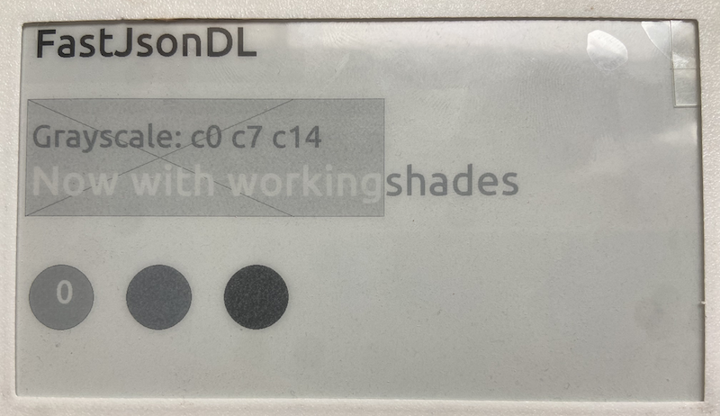

A JSON Domain Language to draw on E-Ink displays by receiving a JSON payload
from any endpoint.  Built on top of
[FastEPD](https://github.com/bitbank2/FastEPD) and packaged as an
**ESP-IDF component** targeting the ESP32 family (primary targets: ESP32-C5, S3, P4).

If you would like a good start to make a web-interface for a basic Canvas draw tool, you can check out:
[FastJsonRenderer](https://github.com/martinberlin/FastJsonRenderer) Using Symfony as a PHP backend and Rest to make the dynamic canvas drawing tool. Is very basic but it can be a great starting point to understand the JSON format and draw some shapes. Soon it will have a Bluetooth send to device feature!
To try it online please go to [draw.fasani.de](https://draw.fasani.de) and be aware that to save or to use the import PNG/SVG feature into G5 image you need to login with your Github account.

---

## Features

- Parses a JSON layout description and issues the corresponding drawing
  commands to a `FASTEPD` display instance.
- Configurable bits-per-pixel mode (`display_bpp` in JSON, or via
  `setDefaultBpp()`).
- Named-font registry — map any string to a FastEPD font data blob.
- In-order item rendering: items in the `"items"` array are drawn
  sequentially, so layering (e.g. black bar behind white text) works
  exactly as written.
- Human-readable error reporting via `getLastError()`.

---

## DEMO

This json code:

```json
{
  "display_bpp": 4,
  "clear": true,
  "items": [
    { "type": "fillRect", "x": 0, "y": 0, "w": 540, "h": 120, "c": 14 },
    { "type": "fillRect", "x": 20, "y": 150, "w": 670, "h": 220, "c": 12 },
    { "type": "drawRect", "x": 20, "y": 150, "w": 670, "h": 220, "c": 4 },
    { "type": "drawLine", "x1": 20, "y1": 150, "x2": 520, "y2": 370, "c": 6 },
    { "type": "drawLine", "x1": 520, "y1": 150, "x2": 20, "y2": 370, "c": 6 },
    { "type": "fillCircle", "x": 90, "y": 520, "r": 60, "c": 10 },
    { "type": "drawCircle", "x": 90, "y": 520, "r": 60, "c": 2 },
    { "type": "fillCircle", "x": 270, "y": 520, "r": 60, "c": 7 },
    { "type": "drawCircle", "x": 270, "y": 520, "r": 60, "c": 2 },
    { "type": "fillCircle", "x": 450, "y": 520, "r": 60, "c": 3 },
    { "type": "drawCircle", "x": 450, "y": 520, "r": 60, "c": 2 },
    {
      "type": "drawString",
      "font": "Ubuntu40",
      "string": "FastJsonDL",
      "x": 30,
      "y": 70,
      "c": 0
    },
    {
      "type": "drawString",
      "font": "Ubuntu30",
      "string": "Grayscale: c0 c7 c14",
      "x": 30,
      "y": 240,
      "c": 7
    },
    {
      "type": "drawString",
      "font": "Ubuntu40",
      "string": "Now with working",
      "x": 30,
      "y": 330,
      "c": 14
    },
    {
      "type": "drawString",
      "font": "Ubuntu40",
      "string": "shades",
      "x": 690,
      "y": 330,
      "c": 9
    },
    {
      "type": "drawString",
      "font": "Ubuntu30",
      "string": "0",
      "x": 80,
      "y": 530,
      "c": 15
    }
  ]
}
```

Will generate the following drawing:


## Top-level fields

| Field         | Type    | Default | Description |
|---------------|---------|---------|-------------|
| `display_bpp` | integer | current EPD mode (usually `1`) | Bits per pixel: `1`, `2`, or `4`. If omitted, FastJsonDL keeps the mode active on the `FASTEPD` instance when it was constructed. |
| `clear`       | bool    | `false` | When `true`, fills the framebuffer with white before rendering any items. Use this to avoid uninitialised pixel data appearing as vertical stripes on the display. |

## Supported item types

| `"type"`       | Required fields          | Optional |
|----------------|--------------------------|----------|
| `drawString`   | `string`, `x`, `y`       | `font`, `c` |
| `fillRect`     | `x`, `y`, `w`, `h`       | `c`      |
| `drawRect`     | `x`, `y`, `w`, `h`       | `c`      |
| `drawLine`     | `x1`, `y1`, `x2`, `y2`   | `c`      |
| `fillCircle`   | `x`, `y`, `r`            | `c`      |
| `drawCircle`   | `x`, `y`, `r`            | `c`      |
| `p`            | `x`, `y`                 | `c`      |
| `loadG5Image`  | `data`, `x`, `y`, `w`, `h` | `fg`, `bg` |

`c` is the colour value and depends on `display_bpp`:
- 1BPP: `0..1`   (`0` = black, `1` = white)
- 2BPP: `0..3`   (`0` = black, `3` = white)
- 4BPP: `0..15`  (`0` = black, `15` = white)

When omitted, `c` defaults to black (`0`).

For `loadG5Image`, `data` must be a byte array and supports:
- decimal byte values (`191, 187, 90, ...`)
- hex strings with or without the `0x` prefix (`"bf"`, `"0xbf"`, `"13"`, `"0x13"`)

> **`drawString` — y is the text baseline**
> FastEPD BB-format fonts (produced by `fontconvert`) treat `y` as the **text
> baseline**, not the top-left corner of the glyph.  For a 40 pt font the
> ascender height is approximately 50 px, so the top of the rendered characters
> sits at `y − 50`.  Setting `"y": 10` with such a font places the glyphs
> almost entirely above the top edge of the screen (invisible, no error).
> Always set `y` ≥ the font's ascender height — for Ubuntu40 use `"y": 50` or
> greater.

---

## Example JSON

```json
{
  "display_bpp": 4,
  "clear": true,
  "items": [
    {
      "type": "drawString",
      "font": "Ubuntu40",
      "string": "Hello from FastJsonDL!",
      "x": 10, "y": 70,
      "c": 0
    },
    { "type": "p", "x": 100, "y": 100, "c": 0 }
  ]
}
```

---

## C++ API

```cpp
// 1. Initialise the EPD panel (FastEPD)
FASTEPD epd;
epd.initPanel(BB_PANEL_M5PAPERS3);

// 2. Create the renderer
FastJsonDL dl(epd);

// 3. (Optional) Register named fonts
static const FastJsonDLFont fonts[] = {
    { "Ubuntu40", Ubuntu40 },
};
dl.setFontRegistry(fonts, 1);

// 4. (Optional) Override display dimensions or BPP default
dl.setDisplaySize(540, 960);
dl.setDefaultBpp(1);

// 5. Render a layout
if (!dl.renderJsonString(myJson)) {
    printf("Error: %s\n", dl.getLastError());
}

// 6. Push to the physical display
epd.fullUpdate();
```

---

## Adding to your ESP-IDF project

### As a managed component (recommended)

Add to your project's `idf_component.yml`:

```yaml
dependencies:
  martinberlin__FastJsonDL:
    git: "https://github.com/martinberlin/FastJsonDL.git"
```

`FastEPD` is intentionally not declared as a managed dependency by this
component. Add your own FastEPD source (for example a submodule or a custom
branch checkout) in your project and wire it as a normal ESP-IDF component
named `FastEPD`.

### As a local component

Clone into your project's `components/` directory:

```sh
cd components
git clone https://github.com/martinberlin/FastJsonDL.git FastJsonDL
```

Then add your own FastEPD component (for example as a submodule pointing to
your preferred branch) under `components/FastEPD`.

Then add `FastJsonDL` to the `REQUIRES` list in your app component's
`CMakeLists.txt`.

---

## Dependencies

| Dependency | Source |
|------------|--------|
| FastEPD | User-provided ESP-IDF component (e.g. local submodule/custom branch) |
| cJSON | Ships with ESP-IDF (`json` component) |

---

## Examples

| Example | Description |
|---------|-------------|
| [`examples/basic`](examples/basic) | Renders a static JSON layout at boot — good starting point. |
| [`examples/ble_receive`](examples/ble_receive) | BLE GATT server that receives a JSON payload over Bluetooth and renders it on the display. Compatible with the [FastJsonRenderer](https://github.com/martinberlin/FastJsonRenderer) client. |

---

## License

See [LICENSE](LICENSE).
